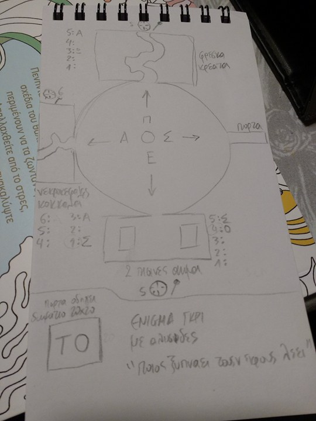

# Campaign log

## light, prestidigitation, dancing lights κλπ color (κωλορ) codes

- κοκκινο: πούτσα, μην πλησιάζετε, keep away κλπ
- πορτοκαλί: danger
- μπλε: εδώ είμαι, ελάτε μη σας γαμήσω

## 14 Ιανουαρίου 2018

- Η κορδέλλα είναι ένα αντικείμενο που θέλει η σχολή λόγω της καλλιτεχνικής της αξίας. Η σχολή απλά ρίχνει άδεια για να πιάσει γεμάτα, γιατί ένας περιπλανώμενος έμπορος είχε μια άλλη κορδέλλα, η οποία δεν ήταν για το shadow plane, αλλά για κάποιο άλλο, επομένως είναι πολύ πιθανό να υπάρχει και μια για αυτό που νοιάζει τη σχολή. Αυτός ο έμπορος εμφανίζεται τις πρώτες μέρες του χειμώνα και έχει συνήθως τηλεοράσεις που παίζουν και διάφορα σόου.
- Ο Νάρβας πήρε ένα πανάκριβο δαχτυλίδι με 20g ο τσίπης για να το δώσει και καλά στη Σπιντίρα. Πήγε και έκανε ο σατανάς πρόταση στη Σπιντίρα και της είπε να την παντρευτεί την άνοιξη, μέχρι τότε θα είναι σιξ φιτ άντερ, τώρα φθινόπωρο έχει μέχρι την 15 Μαρτίου πολύ χρόνο να το καλοσκεφτεί τουλάχιστον μόνο 20g του κόστισε.
- Ο Νάρβας αποφάσισε να πάρει μαζί του τη Σπιντίρα στο πάρτι, εγώ νομίζω ότι θα φάει κανά αδέσποτο φαιρμπωλ στο κεφάλι.
- Φεύγουμε όλοι μαζί για να πάμε στα σιράχ για να δούμε τι είδε ο φέουνας, ο αρχηγός των σιράχ. Μετά από τρεις ημέρες φτάνουμε στον καταυλισμό ([Έλενα] είναι με βρώμη αλλά έχουνε πολύ ζάχαρη - άσχετο, αλλά γούσταρα). Αυτός μας περίμενε πάρα πολύ καιρό και μας μιλάει με τελεπαθι στα κομον. Παλάβωσε που πέθανε η Ελίκουις. Η Πιλελά, μια θηλυκιά μπορούσε να δει ενέργεια από τον κόσμο των μπιστλαντς και όταν το έπιασε έγινε κανονικιά, γιατί η ενέργεια μπήκε μέσα της και έκανε μια σύνδεση μαζί της και τώρα βρήκε τον εαυτό της. Προφανώς η "ενέργεια" είναι sexual innuendo. Τώρα η Πιλελά μπορεί να βρει και άλλα κομμάτια ενέργειας και να γίνουν και τα άλλα σιράχ μεγάλα, άμα το αγγίξουν. Κάτι λέει η πιλελά για κάποιους σκοτεινούς τύπους πάνω σε μαύρα άλογα με μαύρες μάσκες. Αυτοί οι τύποι περάσανε πριν ενάμησι φεγγάρι, δηλαδή περίπου 13 μέρες.
- Αποφασίσαμε να βοηθήσουμε την Πιλελά και τα σιράχ για να βρούμε και άλλες τέτοιες πούτσες για να τις πιάσουνε τα θηλυκά σιράχ και να γίνουνε μεγάλα. Μαζί μας έρχονται 16 σιράχ - 8 θηλυκά και 8 αρσενικά. Μια μέρα πριν πάμε στην Ατεούνια, η Πιλελά πιάνει κάτι και την ακολουθούμε. Το επόμενο πρωί φτάνουμε σε ένα σημείο κοντά στα βουνά που ήταν τα ορκς και η Πιλελά μας λέει ότι είμαστε πολύ κοντά. Το δάσος είναι σάπιο με μεγάλα δέντρα χωρίς πολλά φύλλα, αλλά υπάρχουν και δέντρα που κόβουν τον ήλιο και το έδαφος είναι γλιτσερό με πέτρες και έτσι δεν πάμε πολύ γρήγορα, αλλά κάποια στιγμή η γη έχει ένα δόντι που το καβαλάει η Πιλελά και λέει νατονάτο. Αυτά το περικυκλώνουν και μιλάνε μεταξύ τους τηλεπαθητικά και κάτι συζητάνε χωρίς ινβιζιμπίλιτι. Εκεί γύρω υπάρχει ένα πολύ μεγάλο γέρικο δέντρο με νέα δέντρα γύρω γύρω, αλλά είναι ένας πολύ μεγάλος κορμός και επιβλητικός στα 50 μέτρα αριστερά, σα να έχει πεθάνει στη μέση. Φεύγει ένα αρσενικό κοιτάει αριστερά δεξιά σα να περνάει τον δρόμο πάει παρακάτω απλώνει το χέρι και κάνει κγκγκγκγκγκ και συνδέεται με την ενέργεια με τη δύναμη του γκρεισκαλ. Τα θηλυκά έχουνε καλύτερη αντίληψη των πραγμάτων γύρω μας αλλά τα αρσενικά είναι πιο γρήγορα και με μεγαλύτερα νύχια.
- Πάνω στον κορμό του δέντρου έχει ζάρες που μέσα σε μια ζάρα έχει το σήμα του Ασκάλις (φάση ταδε + ασκαλις = lfe). Παλαβώνουμε με το δέντρο και το περιτριγυρίζουμε, αλλά το άβαταρ του Γκάμους πάει και ρίχνει ακρομπάτικς και το ανεβαίνει τσουπ τσουπ και βρίσκει μια μικρή κουφαλίτσα η κουφαλίτσα. Πετάξαμε ένα μπολ μπεαρινγκ με λαιτ μέσα και παλαβώσανε κάτι νυχτερίδες και βγήκανε και έχει πλακόστρωτο μέσα. Η Σπιντίρα σα το καργιολάκι καβαλάει το Νάρβας και θέλει να έρθει μαζί αλλά εμείς σχεδιάζουμε να την ανατινάξουμε το βράδυ.
- Μέσα το δωμάτιο είναι τουρλωτό με 4 πόρτες και έχουνε σιδερένειες μπάρες που είναι μια χαρά σύμφωνα με τον ρόγκ. Το δωμάτιο μέσα έχει βελάκια και τέσσερα γράμματα που λένε ΠΕΑΣ. Οι πόρτες είναι ανοιχτές οπότε δεν ξέρουμε ποιά να διαλέξουμε. Ανοίγει ο ρογκ το Π και μέσα έχει μια μυρωδιά με σφαχτάρια με μπόχα της πουτάνας, δεξιά και αριστερά έχει κομμένες σάρκες φιλέτο και έχει στη μέση ένα δρομάκι, στο βάθος ένας διακόπτης με έναν δίσκο. Τα κρέατα ήταν μιξ γκριλ. Το Α έχει μέσα το ίδιο αλλά έχει κόκκαλα. Εκείνη την ώρα αποφασίζει ο Βίνσεντ να μπει μέσα στο Α και ο ντιεμ κάνει υπολογισμούς, μάλλον την γάμησε. Ο Δίσκος λέει 12345. Η άλλη πόρτα έχει πολλά κόκκαλα και δη και κρανία αλλά τώρα ο δίσκος έχει 6 γραμμές 123456. Το Ε έχουν δύο πισίνες με πάρα πολύ αίμα με δίσκο 12345, ενω το Σ είναι ένας διάδρομος που οδηγεί σε μια άλλη πόρτα. Αυτή η πόρτα είναι ξεκλείδωτη αλλά με το ντάγκερ ο ρογκ βρίσκει έναν μηχανισμό που θα ενεργοποιηθεί άμα θα ανοίξει η πόρτα και θα είναι πούτσα για το προς τα μέσα δωμάτιο ή αλλού και όχι για προς τα έξω. Εκεί λοιπόν αποφασίζουμε πως όλοι θα ανέβουμε επάνω για να δοκιμάσουμε τον μηχανισμό, ανεβαίνουμε όλοι επάνω και τον δένουμε με ένα σχοινί, εκείνος ανοίγει την πόρτα και κλείνει η πόρτα πίσω του, δηλαδή δεν ήταν σωστό πως επηρεάζει προς τα μέσα, επηρεάζει και προς τα έξω, πούτσα ρογκ. Το δωμάτιο είναι 20x20, αλλά δεν το βλέπει, το μυρίζει το ζυγίζει και μετά ανάβει το δαυλί (κάνει ρίμα το καυλί και γουστάρω). Κάτω έχει σκαλισμένο με μεγάλα γράμματα ΤΟ και εκείνη την ώρα κάποιος ξυπνάει τους νεκρούς και σέρνονται αλυσίδες, γιατί εάν είσαι νεκρός σε δένουνε με αλυσίδες, makes sense. Τεσπα είναι μια ομορφιά τζίνι με αλυσίδες, μάλλον γουστάρει σαδομαζό και ρίχνουμε ινισιατιβ.
- [Μανώλης] Ο ντιέμ δεν μπορεί να κάνει μουλτιτασκιν.
- Ο Νάρβας προσπαθεί να πείσει την Σπιντίρα να φύγει, αλλά δεν μπορεί να κάνει διάλογο μέσα στη μάχη, γιατί εκείνη φοβάται. Εκείνη την ώρα το σαδομαζό φάντασμα χτυπάει τον ρογκ εκείνος κάνει ανκανιτοτζ και τρώει τα μισά, αλλά τον δένει. Οι υπόλοιποι κατεβαίνουμε και μοιραζόμαστε στα δωμάτια, αλλά η νεκροκεφαλή που έχει μπει απάνω του του ρουφάει την ζωτική του ενέργεια και του κάνει νταματζ. Κατεβαίνει και η Σπιντίρα το κοντοπούτανο, θα την κάνουμε αλάχουακπαρ για να σκοτώσουμε το σαδομαζό φάντασμα. Ο ρογκ πάει να κάψει το σαδομαζό φάντασμα αλλά δεν τα καταφέρνει. Η Σπιντίρα είναι γιόλο "τοέχω" "χολντ μαι μπιρ γουαιλ αι ντο δις σιτ" και έχει κάτσει κάτω σα να είναι έτοιμη να κατουρηθεί. Γυρνάω τον δίσκο του δωματίου με το αίμα στο 5 και γυρνάω και τον διακόπτη και μετά κατεβάζω τον μοχλό, ο Βίνσεντ κάνει το ίδιο, αλλά το καθυστερημένο άβαταρ του γκάμους δεν γυρνάει τον διακόπτη σε αυτό που συμφωνήσαμε. Ο Νάρβας φιλάει την κοντή και της ρίχνει και ένα ντράι χαμπ και αναρωτιέται τι να κάνει. Εγώ που είμαι στα αίματα ανοίγει μια μαλακία και ανοίγει ένα Σ και σιγά σιγά από τη δεξιά πισίνα βγαίνει μια πούτσα από αίμα σε σχήμα ανθρώπινο την οποία τη χτυπάω στο κεφάλι. Στο δωμάτιο του Βίνσεντ ανοίγει το Α και έρχεται ένα γιγαντιαίο ζαμπόν πάνω του στο οποίο κάνει φαιρμπολ επειδή του το είπα, γιατί ο καθυστερημένος ήθελε να του κάνει μπερνιν χαντς. Αυτή η μαλακία από το αίμα με καίει και για αυτό εγώ την ανατινάζω. Εκείνο του Βίνσεντ πήγε να τον γαμήσει με τις χούφτες του, αλλά αστόχησε. Το άβαταρ του γκάμους γυρνάει τον μοχλό του και βαράει με 1249012 επιθέσεις με μπλατζεονινγκ μπουνιές έναν σκελετό και κάνει δύο βήματα πίσω. Ο Βίνσεντ κάνει μια ώρα να αποφασίσει τι σπελ θα κάνει και έτσι μας γαμάει όλους από τον κώλο και στο τέλος αποφασίζει να κάνει μπερνινγκ χαντς, δηλαδή για τον πούτσο, αλλά του ξήλωσε τις ραφές και το σκότωσε.
- [Μανώλης] Είμαι φλιπεράκι.
- [Μανώλης] Νομίζω ότι πρέπει να σταματήσεις να ζωγραφίζεις, γιατί δεν έχεις καταλάβει.
- [Κωστας] Ή να βρούμε μια λέξη που σχετίζεται με το "ΤΟ".
- Ξαφνικά το τυπάκι που αλλάζει πλειν βγαίνει μέσα από την κλειστή πόρτα.
- Ο ντρουιντ ξαφνικά νιώθει πως είναι σχετικά φυσικό να αναστήσουμε τον ρογκ που τον τρώει άσχημα από τον κώλο.

*Εδώ τα κάναμε μουνί γιατί ο γρίφος ήταν λανθασμένα σεταρισμένος. Κοφι μπρεικ. Ελεβειτορ μιουσικ.*

- [Μανώλης] Εάν ακολουθήσουμε την ίδια λογική, το πάτωμα και το πτώμα έγιναν άλλα.

*Εδώ τσακώνονται για το ποιος είπε τι, αλλά δεν μπορούσα να τους παρακολουθήσω πολύ καλά*

- Βγαίνει ένας σκελετός χωρίς ουρά σκορπιού που είναι πολύ σπεσίφικ για περιγραφή, εκτός και εάν οι σκελετοί έχουν όλοι ουρά σκορπιού. Ο Νάρβας του γαμάει την παναγία με βίσιους μοκερι.

**Κάποια στιγμή λέει η Έλενα, έχει ΑΑ και Ω, εάν είναι ρήμα μπορεί να είναι το "ΑΓΑΠΑΩ". Και εγώ ο Μήτσος της λέω "ή το ΓΑΜΑΩ". Ήταν τόσο καταπληκτικά αστείο που έπρεπε να το καταγράψω.**

- Ασφαλές πέρασμα εχθρός εμπρός.

*Πρώτο φαιρμπολ Έλενας*

- Δύο γκόλεμ γαμήσανε την παναγία στη Σπιντίρα το κοντοπούτανο και την πετάνε στην άκρη και βλέπει τον ουρανό σφοντύλι.
- [Έλενα] Δεν ξέρω εάν η Σπιντίρα είναι αυτός (δηλαδή ο Κώστας) είναι πιο κοντρατιέμπο. Έχω μπλέξει. Η Έλενα της κάνει χιλιν γορντ και όλα καλά, εγώ θα έλεγα να της κάνει ένα σλιπ να πάει να γαμηθεί.
- Μέσα από τις σάρκες ξεπηδάει ένα πράγμα σαν ελέφαντας που είναι λαρτζ και έρχεται καταπάνω στο άβαταρ του γκάμους.
- [ντιεμ] Να σου πω, στην αρκούδα βάζεις το +1 εισι που 'σου 'χω πει; *οκγουορντ σαιλενς* [ντρουιντ] όχι.
- [Κώστας] Πόσοι είναι έξω; 2 Σκελετοί, ένας μιντιουμ, ένας λάρτζ είναι και περίοδος εκπτώσεων και έχουμε βγει για τσερτς.

*Δεύτερο φαιρμπολ Έλενας*

- [Διονύσης] Έχει αυξημένη ξυλοφορητικότητα.
- #whenyourhitpointsequalsthenumberofyourlegs
- Ο ελέφας δεν χωράει να περάσει από την πόρτα γιατί είναι χιούτζ.
- Μου έκανε 4 επιθέσεις και μου γάμησε τα πρέκια, αλλά μετά το άβαταρ του γκάμους ανλισντ χελ και έτσι γαμήθηκε.
- ΑΣΦΑΛΕΣ ΠΕΡΑΣΜΑ ΣΤΟ ΕΔΑΦΟΣ, δεν περιγράφω άλλο.

## 30 Δεκεμβρίου 2017

- Φύγαμε από την Οκσανζα και πάμε πίσω στην Ατεούνια με το πτώμα της Ελίκουις για να το θάψουμε.
- Κάποιες από τις φυλές των ορκ μετακινηθήκανε οπότε δεν υπάρχει πια κίνδυνος από αυτά.
- Ο Ντόρπος μας έδωσε ένα σπίτι, το οποίο δεν μας ανήκει και πάει πίσω στην ιδιοκτησία του όταν πεθάνουμε. Ευχαριστούμε πολύ Ντόρπος, [μας υποχρέωσες](https://www.youtube.com/watch?v=7nyBXdg1mrA).
- Πήγαμε στην κηδεία της Ελίκουις, o Ολαένιελ έκανε ντισπελ στο ξόρκι που διατηρούσε το σώμα της άθικτο.
- Μου έκαναν προσφορά για δουλειά στον ναό του Γκάμους.
- Ένα διαόλι είπε στον Βινσεντ να σκοτώσει τον Έβανς Τιλκοτ. Δεν ξέρουμε γιατί και τι μπορούμε να κερδίσουμε για αυτό. Ο Αλόνζο ξέρει τον Τίλκοτ.
- Είναι προμηθευτής σιταριού και είναι νεόπλουτος επειδή ο ανταγωνισμός έχει χαμηλότερης ποιότητας σιτάρι. Είναι καλός άνθρωπος και ψηλομήτης και δείχνει με το παραμικρό ότι έχει λεφτά. Έχει μια γυναίκα και δύο παιδιά.
- Ήρθε η ώρα να μάθουμε γιατί ο Νάρβας είναι η κώλλα. Έχασε τα πάντα επειδή ευθυνοταν η Ελικουις, γιατί όταν έπαιζε στην Ατεούνια ο Νάρβας ήρθε εκείνη και έπρεπε να δημιουργήσει αντιπερισπασμό. Θεώρησε καλή ιδέα να πάει και να αλλάξει τα γιουκαλέλε των βάρδων και να του γαμήσει την ψυχή. Και για αυτό σκοτώσαμε τον άλλον βάρδο. Σχόλιο Νάρβας "Α! Ώστε έτσι!"
- Ο Αλφόνσε βλέπει οράματα. Πρώτο όραμα: είδε τη γη από μακριά και η γη ήταν κατεστραμένη με μια πάχνη από σκόκη και το έδαφος ήταν καμέμο και όλα ήταν σκατά και σε έναν κεντρικό δρόμο υπήρχαν 3 ταύροι με ένα κεφάλι (ένας ταύρος με 3 κώλους). Στον έναν καθόταν η Ελίκουις στον άλλο ο Βίνσεντ και στον τρίτο Ολαένιελ. Σβουνιές αφήναν πίσω τους από τον κώλο για να φυτρώσουν τα λουλούδια. Από όταν πέθανε η Ελίκουις έχει μόνο έναν ταύρο με 3 κεφάλια αλλά ο ταύρος δεν είναι ο ταύρος είναι δαιμονοτραύρος και πάνω του κάθεται ο Βίνσεντ και στο ένα κεφάλι το κρατάει ο Ολάνιελ με πολύ δύναμη γιατί ήταν ανήσυχο και έχει και ένα κεφάλι τρελαμμένο και τώρα πια δεν αφήνει πίσω του σβουνιές αλλά πετάει φωτιές και καιγόμαστε όλοι οι υπόλοιποι και καιγόμαστε. Είναι δαιμονοταύρος και αυτό έχει μεγάλη σημασία γιατί μάλλον αυτό είναι πολύ συμβολικό. Η μόνη λύση που βρίσκουμε είναι να αναστήσουμε την Ελίκουις και να την πάμε να καβαλήσει τον ταύρο.
- Ο Αλφόνσε βλέπει και προσωπικά οράματα και ένα από αυτά είναι να φτιάχνει τον εαυτό του γιατί είναι ρομπότ και για αυτό το λόγο ήθελε να φτιάξει μια γκόμενα σα το τέρας του φρανκεστάιν. Ένα βιβλίο που διάβασε δεν έχει καταλάβει πως λειτουργεί αλλά όπως κοίταγε τα δέντρα συνειδητοποίησε ότι μπορεί θυσιάζοντας κάτι από αυτόν μπορεί να φτιάξει (1 str, 1 con, 1 dex θα βγει αρσενικό και με 1 int, 1 wis, 1 cha θα βγει θυληκό). Θέλει και κάτι υλικά που με 5000 γκολντ θα του τα πάρουμε. Από ότι φαίνεται θηλυκό θα φτιάξει, εκτός εάν είναι πούστης, αλλά πούστης είναι ο άλλος με τον δαίμονα.
- Ο Ολάνιελ δεν είχε μοιραστεί μαζι μας πράγματα γιατί ήταν πρόσφατος ο θάνατος της Ελίκουις και δεν είχε πολύ όρεξη. Το ένα είναι αυτό που είπε ο Βίνσεντ, ότι η Ελίκουις προστάτευε τον Νάρβας και τώρα που πέθανε θα συνεχίσει ο Ολάνιελ να τον προστατεύει, γιατί είναι κοντός.
- Το δεύτερο που θέλει να πει ο Ολάνιελ είναι ότι είδε ένα όραμα μετά τον θάνατο της Ελίκουις ενώ ήταν σα λύκος μέσα στην παραζάλη που είναι μάλλον μέσα από τα σιράχ. Έλεγαν "αυτό είναι το βρήκαμε", μάλλον ήταν η φωνή του Φέονα, ο αρχηγός των σιράχ. Δεν ξέρει εάν είναι σόλιντ στοιχείο.
- Το τρίτο που θέλει να πει ο Ολάνιελ είναι ότι μετά από κάποια βόλτα που έκανε στην άκρη του δάσους εκεί που βρήκαμε την Ελίκουις νεκρή, ενώ ήταν λύκος, είδε την ορδή των ορκ και στις άκρες του στρατού υπήρχαν δύο μαυροφορεμένοι καβαλάρηδες που μάλλον καθοδηγούσαν τα ορκ. Αυτό σημαίνει μάλλον ότι η ψυχή της Ελίκουις έχει παγιδευτεί από τον Ασκάλις.
- Η κορδέλα του Νάρβας κοστίζει 5000g αμοιβή από το κολλέγιο καλών τεχνών της Ατεουνίας. Θέλει ο Νάρβας να βρει την κορδέλα και να τη δώσει στο κολλέγιο έτσι ώστε να μεγαλώσει το πουλί του όσον αφορά στο το κολλέγιο.

## 25 Δεκεμβρίου 2017

- Ετοιμαστήκαμε για την επίθεση της πόλης.
- Αποφασίσαμε να φυλάξουμε την ανατολική πύλη, ενώ οι κυνηγο θα φύλαγαν τη δυτική.
- Είχαμε μια μικρή μάχη με προσκόπους των orc, αλλά δεν ήταν σε καμμα περίπτωση οι αρχηγοί που θα έδιναν το σήμα για την επίθεση.
- Μετά από φασαρία που ακούσαμε τρέξαμε στην δυτική πύλη, όπου είδαμε πολλούς την Ελίκουις και πολλούς κυνηγούς νεκρούς.
- Η πόλη δέχτηκε επίθεση από τα όρκς μετά από λίγο.
- Ένας μισθοφορικός στρατός (Ablifis) έσωσε την πόλη.
- Ενημερώσαμε τους θετούς γονείς της Ελίκουις ότι θα μπορούσαμε να την αναστήσουμε και φύγαμε για άλλη πόλη στην οποία θα μπορούσαμε να βρούμε κάποιον cleric αρκετά υψηλού level που θα μπορούσε να το κάνει.

## 19 Νοεμβρίου 2017

- Μιλησαμε με τον Νάρβας.
- Ακούσαμε για το σημάδι που θα ξεκινούσε την υπόθεση σε ένα μπαρ.
- Ακολουθήσαμε τα αποβράσματα, αποσπάσαμε ό,τι πληροφορίες μπορούσαμε και τους ξεπαστρέψαμε.

Επίσης:
- Μιλήσαμε με την γυναίκα μου και τον άντρα της - να κάνουμε follow up εάν εκείνος μίλησε στις αρχές για την επίθεση.
- Μιλήσαμε με τους φρουρούς για το dome.
- Η Ελίκουις είναι κάπου χαμένη γύρω από την πόλη.
